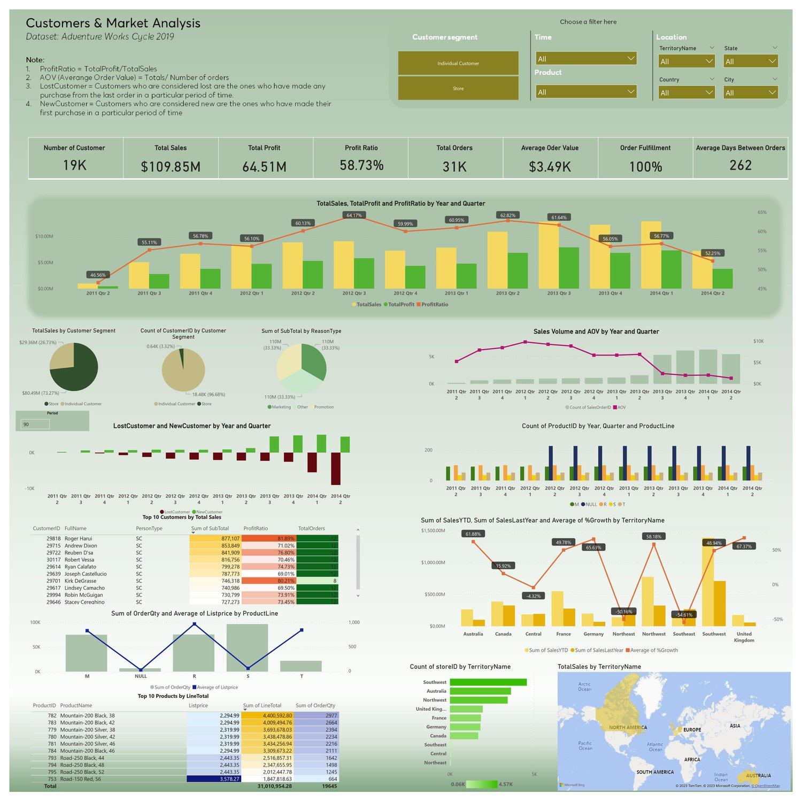

# JennVu - Data Analyst

#### Technical Skills:

• Data Analytics: Python (Pandas, Matplotlib, Seaborn, Scikit-learn), SQL (Google Bigquery)

• Data Visualization by Python (Plotly and DASH), Power BI (DAX, data modeling)

• Machine Learning: LightGBM, Scikit-Learn

## Work Experience
**Wooribank Vietnam - VnEpxress – Hanoi, Vietnam [Sep 2023 – Now]**
[MARKETING STRATEGY CONSULTANT]
- Generated comprehensive reports on Basel, credit management, collateral management, and provision, ensuring adherence to SBV and CIC reporting standards.
- Spearheaded the automation of reports and periodic tasks, improving efficiency and data accuracy.
- Designed interactive dashboards to provide insights to BOD on non-performing loans (NPLs) and overdue rate, aligned with both Korean and Vietnamese standards.
- Led the development and implementation of a collection modeling system, encompassing data feature planning, system interface design, model training and testing, deployment, and recommendations for the post-loan management team.
  #### Project: Bad debt collection prediction:
  **Target:**
  A model that prioritizes debt collection actions by predicting each customer's likelihood of repayment.
  
  **Framework:**
  Machine learning (LightGBM) was used to analyze customer data, and a Markov decision process was used to determine the optimal action strategy.

**FPT Online - VnEpxress – Hanoi, Vietnam [Nov 2019 – Feb 2023]**
[MARKETING STRATEGY CONSULTANT]
- Spearheaded business growth by leveraging data-backed insights and collaborating with cross-functional teams.
- Crafted innovative marketing campaigns, surpassing targets and achieving exceptional results for internal and external projects.
- Successfully developed resource-efficient technical plans for partnerships with ticket distributors, optimizing processes through data-driven insights.
- Achieved a 400% increase in ticket sales for VnExpress Marathon Ha Long by analyzing data and consumer behavior.

## Personal Projects

### Adventure Works Project - Data Visualization /Personal project
• Utilized SQL to extract data from 12 different related tables from “AdventureWorks 2019” sales
databases using JOIN and VIEW working with Google Bigquery

• Loaded and modeled data in Power BI

• Created a dashboard using DAX in Power BI to help extract valuable insights from raw data to
identify early warning signs of problems, determine best customers across product lines for focused
sales efforts, categorize customer issues based on demographic groups, analyze customers' buying
patterns and preferences.

### Customer Segmentation using RFM Model Personal project
• Utilized Pandas (Python) to perform RFM-based customer segmentation
• Discovered the relation between given factors to find insights and explanations by each group’s buying
behaviors.
• Used Matplotlib and Seaborn to visualize data and make presentations to non-tech stakeholders.
[See my work here](https://github.com/JennVu/Python.CustomerSegmentation/tree/main)
### Phone Market Personal project
• Queried data to answer a series of questions for stakeholders about the phone market by using SQL
(Google Bigquery)
[See my work here](https://console.cloud.google.com/bigquery?sq=886752833240:2b280ea73abe47ce9abc0bf9be5eb412&project=youtube-project-394302&ws=!1m4!1m3!8m2!1s886752833240!2s2b280ea73abe47ce9abc0bf9be5eb412)

## Education
**Full-time education**

National Economics University – Hanoi, Vietnam

Bachelor's Degree in Marketing – Specialization: Marketing Communication- GPA: 3.26/4

IELTS: 7.5 dated July 2023

**Data Analytics Courses**

Datacamp.com 16 courses including SQL, Power BI, Python, and Machine Learning
[See my certificates here](https://drive.google.com/drive/folders/1QnfDKsw97YlSYwgNIhzFUYm1eYda4s05)
